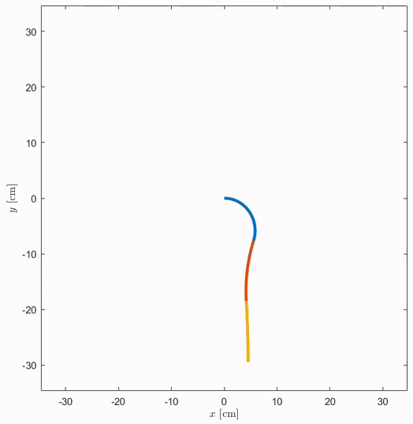
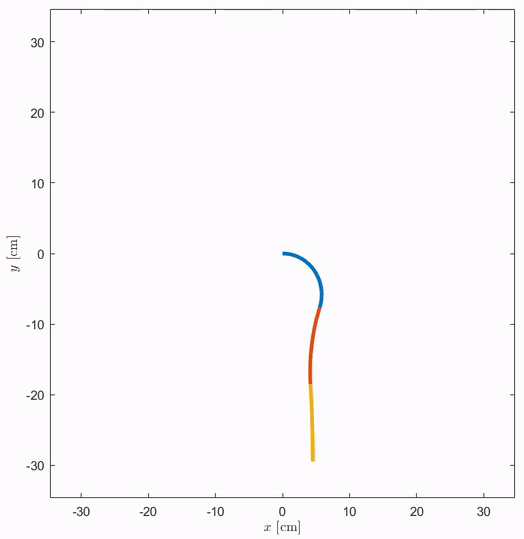

# Piston-Driven Pneumatically-Actuated Soft Robots: modeling and backstepping control

## Abstract
Actuators' dynamics have been so far mostly neglected when devising feedback controllers for continuum soft robots since the problem under the direct actuation hypothesis is already quite hard to solve. Directly considering actuation would have made the challenge too complex. However, these effects are, in practice, far from being negligible. The present work focuses on model-based control of piston-driven pneumatically-actuated soft robots. We propose a model of the relationship between the robot's state, the acting fluidic pressure, and the piston dynamics, which is agnostic to the chosen model for the soft system dynamics. We show that backstepping is applicable even if the feedback coupling of the outer on the inner subsystem is not linear. Thus, we introduce a general model-based control strategy based on backstepping for soft robots actuated by fluidic drive. As an example, we derive a specialized version for a robot with piecewise constant curvature.

## Paper
This repository contains the simulations as presented in the paper _Piston-Driven Pneumatically-Actuated Soft Robots: modeling and backstepping control_ by Maximilian Stölzle and Cosimo Della Santina published in the _IEEE Control Systems Letters_.

Please cite our paper if you use our method in your work:
```bibtex
@article{stoelzle2022piston,
  title={Piston-Driven Pneumatically-Actuated Soft Robots: modeling and backstepping control},
  author={Stölzle, Maximilian and Della Santina, Cosimo},
  journal={IEEE Robotics and Automation Letters},
  publisher={IEEE},
  year={2022},
  volume={6},
  number={},
  pages={1837-1842},
  doi={10.1109/LCSYS.2021.3134165}
}
```

## Control Scheme


## Simulation
We evaluate our proposed backstepping controller on the example of a planar three-segment soft robots modelled through the Piecewise Constant Curvature (PCC) approximation. The simulation of the system model and the controller is implemented in Simulink with access to symbolically-derived equations of motion. Additionally, the behaviour of baseline controllers such as end-to-end and coupling-aware PID can be simulated.


## Structure
The following folder structure is used:
- `main.slx`: contains the main simulink model which implements both the controller and the system model. The **Initialisation** block contains physical variables of the simulated robot, the acting gravity vector and the initial robot state. The **Control** block includes both the backstepping and the baseline PID controllers. Please make sure to re-connect the _f_p_ signal to the output of a different controller such as the Pneumatic Actuator model-aware PID or the Full-system model-unaware PID if needed. The **Plant** block implements the PCC forward dynamics and equations of motion and the actuator dynamics. It takes the control action (e.g. the force on the piston f_p) as an input.
- `startup.m`: runs `config.m` and adds folders to the MATLAB path.
- `config.m`: contains the configuration parameters for the derivation of dynamics and some of the simulation run-time parameters. This contains namely the number of segments, the length and mass density of each segment and the equilibrium state of the system.
- `derive_dynamics.m`: this script can be used to derive the element of the Equations of Motion and the conservative forces using the MATLAB Symbolic Toolbox.
- `data/in_qref_ts.mat`: contains the sequence of commanded configuration used for set-point regulation.

## Usage
Below you can find a guide on how to run the code and re-produce the results in the paper.
1. Run the `startup.m` file to set up the environment
2. Derive the dynamics for the planar soft robotic arm through the PCC assumption with the script `derive_dynamics.m`. The resulting symbolic functions for evaluating the dynamics at a specific robot state are automatically saved in the folder `funs`.
3. Generate a control reference sequence with the script `generate_control_ref_sequence.m`. The sequence is automatically saved in `data/in_qref_ts.mat`.
4. Run the simulink model `main.slx` to simulate the system.
5. Animate the PCC system using the script `plotting/animate_pcc_system.m`. It automatically uses the time-series data from the simulation which is saved in the `out` variable of the workspace.
6. Save the `out` variable in a mat-file and save it in the `data` folder.
7. Generate time-series and Cartesian evolution plots using the scripts `plot_cartesian_evolution.m` and `plot_time_series_v2.m` in the `plotting` folder.

## GIFs

Videos of simulations of a planar soft robot consisting of three segments. Gravity is pointing downwards in negative y-direction.

We simulate the response of the closed-loop generated by all controllers to a sequence of step references. The segments are initialised at the equilibrium configuration. At 10s, the reference is moved to the straight configuration q ̄ = 0. After another 30s, we change it again to q_bar = [0.6981 rad −0.5236 rad 0.1745 rad].

### Coupling-aware PID

<p align="center">
  
</p>

### Backstepping

<p align="center">
  
</p>
